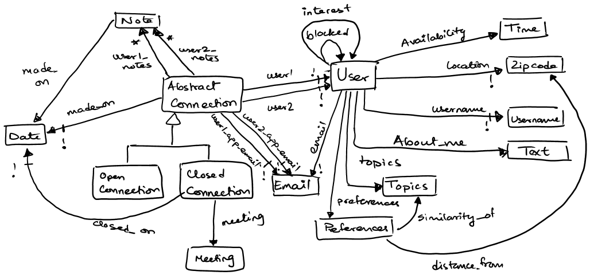
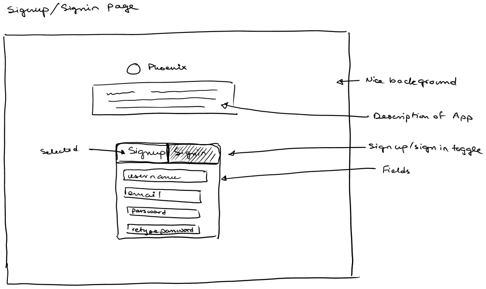
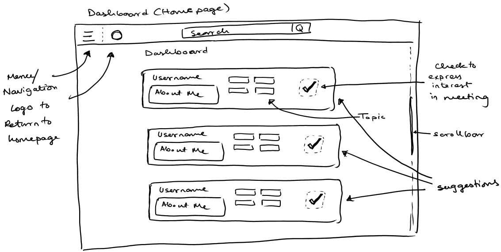
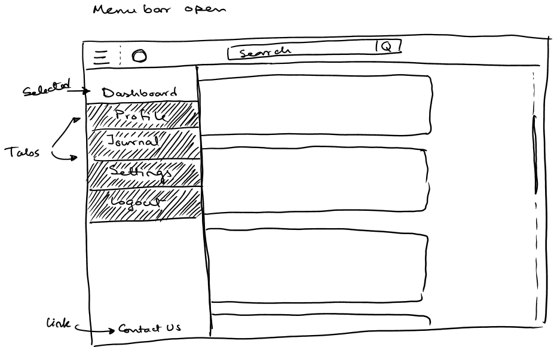
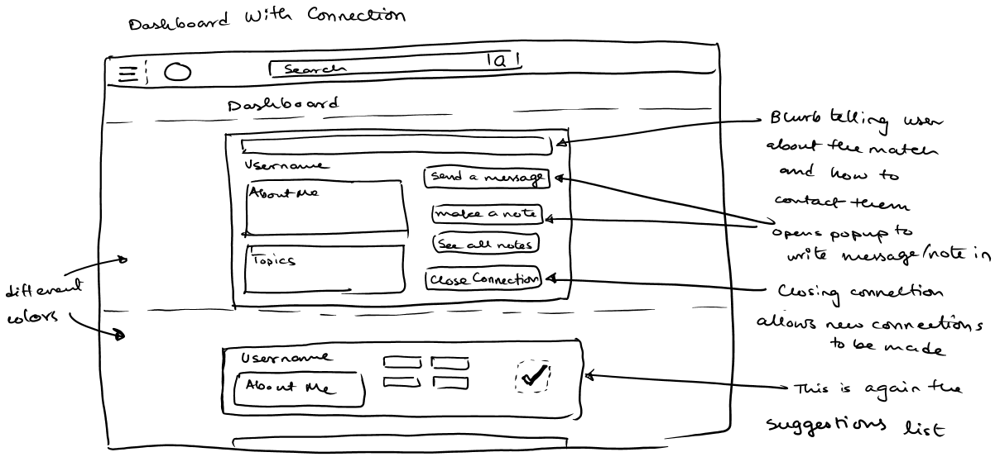
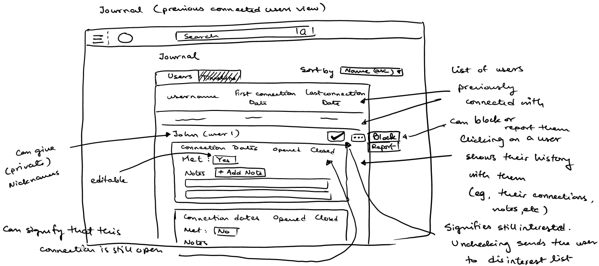
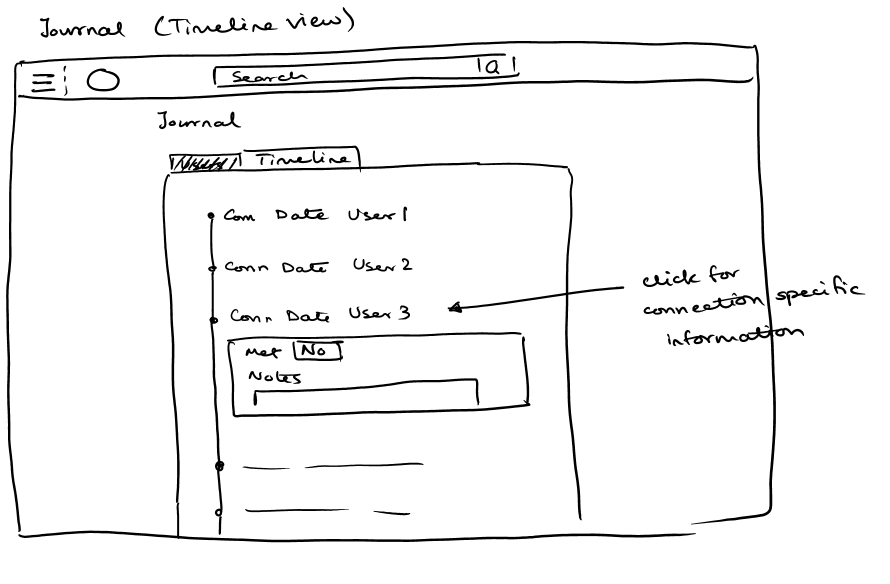
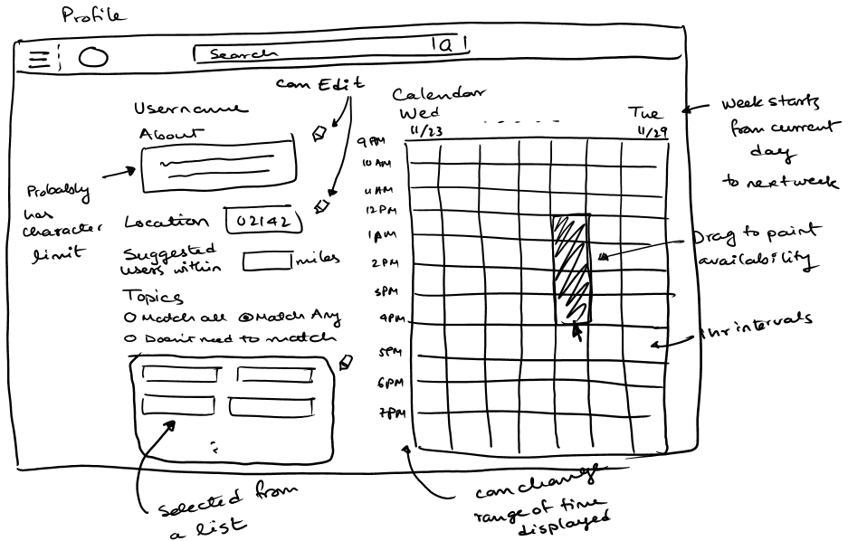
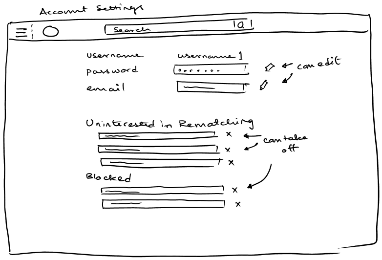

# Phoenix Design Document

## Overview (Kim)

Phoenix is an application that assists people with depression in finding and meeting others with whom they can talk and make friends. Depression can make reaching out to others and setting up get-togethers extremely difficult. To alleviate this stress, Phoenix identifies users who are interested in talking with one another and available at the same times, then suggests a time for the two of them to meet and puts them in touch via email. We hope this will encourage people who might be prone to self-isolation to interact with other human beings, a strategy which has been [shown to help relieve depression](http://www.sardaa.org/2012/08/18/relieve-depression-through-socialization/).

This app will also open the door to discussion of topics more serious than would otherwise be broached in a typical conversation between two people meeting for the first time. In the app, users select topics such as gender, sexuality, or body image, that they would like to talk to someone about. Then, other users are suggested to them based on those selections. This guarantees that someone who you meet through this app is okay with discussing those issues, allowing users to bring them up with less guilt and awkwardness.

Possible competing apps include the friend-finding features of dating apps, such as Tinder Social for Tinder and Bumble BFF for Bumble. However, these services are intended for use in the general population and not directed battling depression. They do not set up a time for you to meet with someone you’re interested in or guarantee that the person you meet is okay with sensitive topics, and users are not anonymous. Because Phoenix does include these features, it is far better equipped to work in the niche we have selected than any existing service.

## Design Essence

### Concepts (Shinjini)

Note: The concepts are presented here in the order they would be introduced to a user using the app.

#### Availability
**Purpose:** To let users indicate when they are available to meet and thereby allow suggestions to meet with other users to be made.

**Operational Principle:** When a user signs up, they are directed to their profile page, where they see a calendar representation of one week from the current date. There, they can indicate which times they are free (would be available to meet) by painting over blocks “whenisgood”-style. A user cannot enter availability for times that have already passed.  The user can enter their availability for further than one week in the future and can edit their availability at any time. Suggestions of other users to meet are made based on the user’s availability in that another user is only suggested if they have overlapping availability in the next seven days. If a user has no available times in the upcoming week, they will have no suggestions of other users.

##### Misfits
**Non-Upcoming Availability:** Users might be suggested based on non-upcoming availability (times that have already passed or are far in the future).

*Mitigation:* To ensure that we don’t make suggestions based on outdated availability, we don’t allow users to enter times that have already passed. To avoid making suggestions based on availability that is far in the future, we will only check for availability in the next seven days.

#### Preference
**Purpose:** To allow the list of suggestions shown to the user be better suited to the user’s personal preferences and limitations (e.g. a user with no car may not be able to travel far to meet someone). This includes what topics they want to discuss and what radius from their location they want to search in.

**Operational Principle:** A user can go to their profile page and change their preferences. Preferences can include whether they want users suggested to them to share topics of interest or if different topics are acceptable or preferred, radius from their location they are okay with to meet someone, etc. Their preferences changes the suggestion criteria and the list of suggestions changes accordingly. The user can change their preferences at any time.

##### Misfits
**Limited Availability/Discussion Preferences:** Having really selective preferences (e.g., many topics selected, but wants to talk about dissimilar topics; very few topics selected and wants to talk about similar topics; very few availability slots over the next week) might limit the user’s choices so they might not be getting very many suggestions.

*Mitigation:* We allow the user to change their preferences and broaden or tighten them accordingly, whenever they want. If a user gets no suggestions, we might suggest that they adjust their preferences to be more open/flexible.

#### Suggestion
**Purpose:** To show users other users who are located nearby, have overlapping availabilities, and compatible topics of interest  with them, and who they could therefore potentially meet.

**Operational Principle:** When a user logs in, they are directed to their dashboard, where they see a list of users who the app suggests they might want to meet. The suggestions depend on users’ preferences (e.g. whether each user wants other users to share the same topics of interest or to have different ones), and the other users being in similar locations and having overlapping availabilities. Suggestions are recalculated every time a user signs into the app, and will disappear if the users no longer have overlapping availabilities, etc. (any change in factors that are necessary for suggestions).

#### Interest
**Purpose:** To let a user indicate that they want to talk to or meet one of their suggested users.

**Operational Principle:** When the user logs in, their dashboard will be populated with suggestions for potential users to connect with. They can read some information about these suggested users such as their about me and their preferred topics of discussion. If the user is interested in talking to or meeting any of their suggested users, they can check a box to indicate that interest. If two users both indicate interest in one another, it becomes possible to open a connection between those users. (Connections are explained under the “Connection” concept.)

##### Misfits
**Mutual Interest Without Connection:** Mutual interests might not result in a connection. Our app is built such that users get one connection at a time. This means that some possible connections might not be made. For instance, if there is mutually expressed interest between User A and User B as well as between User A and User C, only one of those pairs can have a connection at a time. Thus, if users A and B connect, users A and C may never connect.

*Mitigation:* We do not expect this situation to occur often. If it does, we can tweak the algorithm to prioritize more “meaningful” connections. For example, if User B has lots of potential connections but User C has very few, perhaps the connection between A and C should be made before the one between A and B.

#### Connection
**Purpose:** To facilitate a meeting between two users who are mutually interested in each other.

**Operational Principle:** Once two users express interest in each other, we may connect them, allowing a line of communication. This involves assigning an e-mail address alias to each user that the other member of the connection can use to send messages to them. These messages will be routed by the app and forwarded to the appropriate user’s real email. Each connection is also added to its users’ journals where they can keep notes about their connection with other user if they want. (Notes are only visible to the user writing them.) Each user only has one open connection at a time, so once the users have met they must close their connection in order to be connected to other people. Notes about the connection can also be made after the connection is closed. On connection, both users receive a suggestion for a social interaction at a mutually available time.

##### Misfits
**Multiple/Unsustainable Connections:** If a user makes many connections at once, they may become overwhelmed and have to tell multiple connections that they actually cannot or don’t have the energy to meet, or ignoring a connection because they only have the energy to interact with one connection at a time. This can result in stress and guilt on the user’s part, and disappointment for the other user in the connection. 

*Mitigation:* We will allow one connection to be open at a time, and once the users are done with that connection and ready to move on, they can close it. They won’t be connected to any more people until they close an open connection.

**Communication Outside Open Connection:** If users are communicating through the app, a closed connection might prohibit them from communicating that way anymore.

*Mitigation:* If we use an app-created e-mail alias to introduce users, the users can use the same alias to keep in contact, but are allowed to revoke that permission at any time  (by blocking the other user), and messages will no longer be forwarded to the users.

**Communication in Subsequent Connections:** If two users connect more than once via the app, they might eventually be bombarded with several different app emails to contact the same person.

*Mitigation:* We assign app emails per pair of users so that even if two users connect several times, they can just use the same email from before to communicate with them.

**Cornering Other Users:** A user could try to keep another user from getting other connections by not closing it.

*Mitigation:* Either user can close a connection, and it will then be closed for both users.

**Violations of Privacy:** If someone has access to our server, they might be able to see the exchanges of messages between people, which could cause a host of problems.

*Mitigation:* Messages are not saved, only routed via the app. This is to protect the privacy of the users, so that we don’t ever read their messages.

#### Journal
**Purpose:** To keep a record of all the connections a user has made.

**Operational Principle:** Every time a user makes a connection, it is added to their journal. This includes information about when the connection was made, whether they met, when the connection was closed or if it is still open, user made notes about the connection and nicknames the user gives to the other users. They can also access options to put the user in their disinterested list or report users they have previously connected to in their journal.

#### Disinterest
**Purpose:** If a user does not want another user to be suggested to them again, they can put them in their disinterest list to prevent them from being suggested in the future.

**Operational Principle:** After a two users are connected, either of the users can go to their journal and choose the other user and uncheck their interest in them. When they uncheck, we will give them a warning saying that unchecking will prevent the user from showing up in their suggestions again, and that they can undo this just by checking this box again or going to their settings page (they can also cancel at that point). Then in future suggestions, that user will not show up in the list, unless the first user changes their mind, which they can do as indicated before.

##### Misfits
**Being Suggested a User You Don’t Want to Meet With:** A user might not be interested in meeting with a person again after closing a connection, even if they share topic interest and availability (e.g., maybe two people have social anxiety and find it easier and more pleasant to communicate via e-mail).

*Mitigation:* Disinterest in having a user suggested again is not exactly the same as blocking them, so our e-mail communication via the app’s e-mail alias can still continue until one user decides to revoke the permission to allow that. This is to allow two users to continue communication without being suggested to each other again.

#### Block
**Purpose:** To prevent blocked users from making any sort of communication with the blocker via the app.

**Operational Principle:** After a two users are connected, either of the users can go to their journal and choose the other user and block them. Then in future suggestions, that user will not show up in the list, not can the send the blocker messages, unless the blocker changes their mind, which they can do by going to their settings and taking them off the list.

## Challenges

### Design Risks (Casie)

**People Not Meeting Up:** While this app is trying to ease the process of meeting people by setting up a time, an activity idea, and presents a list of topics that might be good for discussion, it’s possible that they still won’t meet up, or may make plans and stand someone up.

*Mitigation:* While we can’t explicitly stop this from happening, we can try to keep as many doors open as possible, and minimize guilty interactions. At minimum, once two people have been connected (shown mutual interest in talking to each other), 

**Harassment Online or Offline:** We can’t really prevent people who intend to harass other users from signing up, but they can be reported, and we can take actions against them. However, bad experiences with people a user meets might deter them from continuing to use the app.

*Mitigation:* We use the list of topics of interest to reveal things the other user might want to talk about before meeting, and later we allow either user to choose to not connect with the other again, block them (cuts off all in-app communication) or to report them (which will block them and alert the administrators of the app).

### Design Choices (Casie and Shinjini)

**Simplifying Finding Meeting Times:** Having many users who you might want to talk to can be overwhelming, and there are many ways to find a time to meet, and even then there can be a lot or only a little overlap, which means the users would have to make a choice about when to meet, with no direction, which can be stressful. However, removing that choice also limits freedom/flexibility, which can also cause stress to users.

*Our solution:* In order to find a middle ground between making choices and limiting freedom, we are filtering users’ suggestions based in part on availability, so when users connect, there is a guaranteed overlapping availability in the next week. While we will make a suggestion of a time they can both make, we also open a line of communication between the two users, so they can discuss other possible times. However, we’re hoping that providing that suggestion will eliminate some of the stress that comes with social interaction.

**Facilitate Actual Meetings:** Even if people are connected online, they may want to meet in person - this can be hard if one person has a car, and one person has no modes of transportation other than walking. We could solve this problem by leaving coordination of in-person meeting up to the users, giving users the option to specify their location radius for suggested users, or suggested users being specifically within each others’ zip codes. Leaving coordination entirely up to users is a potential stressor, and also a potential source of disappointment if users are very far apart. Using preferred radius to inform suggestions is probably the most optimal and flexible solution, but could be hard to implement.

*Our solution:* In order for users to be suggested to each other, they both have to have matching zip codes. One of our stretch goals is to implement the ability for a user to select a radius from their zip code to search in. We will also make sure location can be updated anytime.

**Fear of Rejection:** People may avoid social interaction out of fear that no one will want to interact with them. Models for meeting people could be along the lines of one user requesting a meeting and the other user saying “yes” or “no.” Another model could be that which competitors like Tinder Social use - notification only when both users express active interest. This draws attention to the potential for interaction rather than the rejection of it.

*Our solution:* We require two users to have overlapping availabilities in the next week, compatible topics of discussion, and to have expressed active interest in each other in order for each of them to be notified of the other.

**Limiting Overwhelming Amounts of Social Interaction:** In the real world, people might want to interact with people, but be overwhelmed with large social gatherings like parties, or in general having to interact with many people at once. This situation could be replicated in the app by overwhelming a user with all possible suggestions, and allowing them to open many connections at once. However, limiting users to just one interaction may not be enough interaction for some users.

*Our solution:* We have chosen to err on the side of fewer connections to avoid overwhelming users. Should users want to pursue more social interaction outside of the app, they can do that, or they can close connections with greater frequency (because users can keep communicating once they have been connected), but our main goal is to encourage people to avoid isolating themselves, and we don’t want to overwhelm those people.

**Reducing Instances of Lack of Communication:** In other apps, people often “match” (Tinder Social language), and don’t ever message each other. In our model, in order to be connected with a new user, the current connection must first be “closed,” since users can only maintain one open connection. We could allow people to maintain more than one open connection, but that would undermine our previous point of not overwhelming users.

*Our solution:* We allow either user to close a connection, offer an option not to have that user suggested again, and then they can get another open connection if available. This allows people to meet as many people as they would like to. Users can continue to email each other through the app if the connection is closed (unless one user blocks or reports another), allowing them to interact without feeling trapped in a single connection.

**Flexibility in Scheduling:** Some people have repeat events that they might want to set for the same day every week for convenience’s sake. However, there are some instances in which these recurring events don’t happen (e.g., over winter break, a student doesn’t have classes and might be in a different zip code). We could implement the ability to set recurring events (i.e., times where the user isn’t available) in the calendar, but this would result in some obsolete/inaccurate unavailabilities.

*Our solution:* Our app allows the user to fill out their availabilities to indefinitely in the future but does not allow for automatically recurring events. This is to encourage users to fill out only relevant availabilities, and avoid mindlessly marking things as unavailable. We use availabilities in the next seven days to make suggestions, so users don’t get connected with someone who can only meet 2 months later.

### Model (Shinjini)

#### Textual Constraints
* Usernames have to be unique for each user
* Availabilities are for future dates (older availabilities are deleted)
* Users cannot be interested in themselves, be disinterested in or block themselves or connect with themselves.
* A user can have at most one open connection at a time.
* User1_notes are written by user1 in the connection and cannot be viewed by user2, and vice versa.
* For the same pair of users in any connection, their corresponding app emails remain the same (i.e., if two users connect again, their app email addresses for the other user does not change).

#### Clarifications
* The app email is an aliased email for the user’s email, and messages sent to that email will be forwarded to the real email by the app.
* Similarity_of in the (preferences, topics) relation can range several options, including have-to-match-all, can-match-any, doesn’t-need-to-match, etc. 
* Distance_from in the (preferences, zipcode) relation means the distance from the user's location they want their suggestions to be located.
* Whether two connected users have met or not (meeting) is just a record-keeping device, so can just be saved as a boolean.
* The user1_app_email is used by user2 to contact user1 and vice versa. 

#### Insights
* The “Time”s for availability and “Date”s are different things because of how they are used. Dates represent any time of the day, while Time represent 1-hour intervals formatted to allow easy comparisons of availability overlap.
* Because of how preferences will be used to find suggestions, topics have to be preset list, that users can choose from, as opposed to free text that the user can enter.
* The email address for the user can change (which can be needed for any reason), but the app email does not change, so the other users don’t have to worry about changes in email addresses of their connections.
* The first connection is different from every subsequent connection between two users. We treat the first connection as an introduction, but we assume on subsequent connections that they are already acquainted.

### UI (Shinjini)

### Security Concerns (Casie)

#### Threat Model 

The app is designed to store as little about the user as possible. 
Things stored in the DB that might be sensitive are: 
* Location
* Availability
* Users interested in, disinterested in and blocked 
* Real email address
* App email address (to reach a user anonymously routed via the site)
* Connections
* Notes about connections
* User given nicknames

Assuming that the user does not reveal too much about themself via their username, ‘about me’ and topics of discussion, the only real danger is hacker getting access to their real email address. But since passwords are salted and hashed, it should not help them gain access into the email account. So the only issue is identities being revealed. The users’ about me and topics of interest are public, so those don’t matter. If they get access to the app email, they cannot use it to send emails to the user, since it is only an alias and the app needs to route it to the real email. The app email forwards using a whitelist (people they have had connections to, and are not in the disinterest list), so making the app forward emails will be hard.

The only real issue is that the attacker might find out the identities of a user and their connections and what notes they have made about them. In order to minimize the risk secrets being revealed, we may want the user not to put secret or incriminating data in their notes.

If the attacker is able to figure out a user’s identity, they can use their location and availability maliciously, for example, to stalk them. We are not sure how to mitigate this because our app needs to read the user’s location and availability, so we can’t encrypt them. However, hopefully it will be difficult enough to break into our app and figure out information about the user’s identity that it will not happen.

#### Protection from standard attacks

##### Database injections
We are not using a relational database, and we will only query the database with preset queries and not user inputs, so should not have database injections.

##### XSS Injections
Any input the user makes (in particular, in their ‘about-me’s or any plain-text entries) will be sanitized to protect against adding scripts or entering really long entries by limiting how much data they can enter (character limits), and which characters they can enter (based on how this data will be used). We will also be using Handlebars as our client-side templating framework, so all displayed data will be escaped so that they are not run as code.

##### CSRF attacks
We don’t want people to be able to masquerade as other users or get information about users who are not them. We will be using a CSRF protection middleware designed for Node.js called [csurf](https://github.com/expressjs/csurf) to prevent people from making CSRF attacks on our website.
